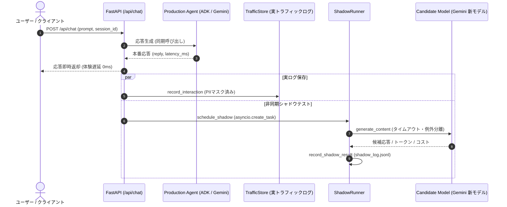

# 👥 Shadow-testing New Models 実装仕様

本番対話 API（`/api/chat`）に対する**オンライン・シャドウテスト（Shadow Testing）**機能を実装しました。

---

## 1. 概要と目的

新モデルの導入やプロンプト変更を安全に行うため、本番ユーザー体験（レイテンシ・正常性）を一切阻害せずに、本番トラフィックを裏で並行して新候補モデル（Candidate Model）へ非同期送信（ミラーリング）し、実環境下での性能・品質・コスト・レイテンシを比較評価します。

### シャドウテストの基本パターン
```python
async def handle_query_with_shadow(question):
    # 1. 本番モデルで同期的に応答を生成し、即座に返却 (ユーザー体験への影響ゼロ)
    production_response = production_model.generate(question)

    # 2. 候補モデルの実行は非同期タスクとしてバックグラウンドで走らせる
    asyncio.create_task(
        shadow_test(question, production_response, candidate_model)
    )

    return production_response

async def shadow_test(question, production_response, candidate_model):
    candidate_response = candidate_model.generate(question)
    log_shadow_result({
        "question": question,
        "production_response": production_response,
        "candidate_response": candidate_response,
        "timestamp": datetime.now()
    })
```

---

## 2. アーキテクチャ



---

## 3. 設定項目 (`.env`)

| 環境変数 | 型 | 既定値 | 説明 |
| :--- | :---: | :---: | :--- |
| `SHADOW_TEST_ENABLED` | boolean | `false` | シャドウテストの有効化フラグ (`true` / `1` で有効) |
| `SHADOW_MODEL_ID` | string | `gemini-3.8-flash` | シャドウテスト対象の候補モデル識別子 |
| `SHADOW_SAMPLE_RATE` | float | `1.0` | サンプリング率 (`0.0` 〜 `1.0`)。実トラフィックの一部のみ実行しコストを抑制 |
| `SHADOW_TIMEOUT_SEC` | float | `30.0` | 候補モデル呼び出しのタイムアウト秒数 |
| `SHADOW_LOG_PATH` | string | `eval/traffic/data/shadow_log.jsonl` | シャドウテスト結果ログの永続化先パス |

> [!TIP]
> **コスト配慮**: シャドウテストはリクエストごとに 2 つのモデルを実行するため、推論コストが増加します。本番環境では `SHADOW_SAMPLE_RATE=0.1`（10% サンプリング）や特定時間窓での運用が推奨されます。

---

## 4. シャドウログデータスキーマ (`shadow_log.jsonl`)

各行は以下の JSON Lines 形式で記録されます（個人情報マスキング適用済み）：

```json
{
  "shadow_id": "3f9c6d48-8ef1-4b47-b248-cb86c6b245a1",
  "session_id": "session-1234",
  "timestamp": "2026-09-25T14:15:30.123456",
  "input_text": "東京のおすすめ観光地を教えてください",
  "conversation_context": [],
  "production": {
    "model_id": "gemini-3.5-flash-lite",
    "output_text": "東京のおすすめ観光地は浅草寺や東京タワーです...",
    "latency_ms": 320
  },
  "candidate": {
    "model_id": "gemini-3.7-flash",
    "output_text": "東京の魅力を満喫できる観光スポットをご紹介します...",
    "latency_ms": 480,
    "prompt_tokens": 120,
    "candidate_tokens": 180,
    "finish_reason": "STOP",
    "cost_usd": 0.000126,
    "status": "success",
    "error_message": null
  }
}
```

---

## 5. API エンドポイント

### 1. ステータス確認
- **`GET /api/eval/shadow/status`**
```json
{
  "enabled": true,
  "candidate_model_id": "gemini-3.7-flash",
  "sample_rate": 0.2,
  "timeout_sec": 30.0,
  "log_file_path": ".../eval/traffic/data/shadow_log.jsonl"
}
```

### 2. シャドウテスト比較レポート取得
- **`GET /api/eval/shadow/report?limit=100`**
  - 本番モデル vs 候補モデルの完全一致率、平均類似度（レーベンシュタイン距離）、レイテンシ差、平均文字数差、消費トークン・概算コストを集計した JSON および Markdown レポートを返却します。

### 3. Side-by-Side A/B 投票 & 勝率サマリ
- **`POST /api/eval/feedback`**: ユーザーの投票（A / B / tie）を保存
- **`GET /api/eval/feedback/summary`**: これまでのユーザー投票結果と勝率（Win Rate）を返却

### 4. Gemini Batch API (50% OFF) コスト削減試算
- **`GET /api/eval/batch/finops`**: 蓄積ログに対する Batch API 適用時の 50% 割引コスト削減額を返却

---

## 6. Gemini Web 風 Side-by-Side ブラインド A/B テスト

フロントエンド（React チャット画面）では、Gemini 公式サイトと同様の Side-by-Side 比較カードを提供します。

### 特徴
1. **位置バイアス（Position Bias）の完全排除**:
   - ユーザーが「左（A）を選びがち」になるバイアスを防ぐため、裏側で 50% の確率で A/B のモデル配置をランダムにシャッフルします。
2. **モード切り替え**:
   - ヘッダーのセレクターから「自動（時々）」「常時オン ⚡️」「オフ」を即座に切り替え可能。
3. **投票後の正解開示（ネタばらし演出）**:
   - 投票ボタンを押すと、「実は… 回答 A は `gemini-3.7-flash`、回答 B は `gemini-3.8-flash` でした！」とバッジが開示され、勉強会やデモで大いに盛り上がる演出を備えています。

---

## 7. Gemini Batch API (50% OFF) による FinOps 最適化

シャドウテストによる「推論コスト倍増問題」を解決するため、Google Cloud の **Gemini Batch API（通常の 50% 割引・半額）** を組み合わせたハイブリッド運用を実現しました：

1. **リアルタイム A/B テスト (10% 〜 20%)**:
   - 画面上でユーザー体験とフィードバック（Human Preference）を収集。
2. **バッチ・シャドウテスト (残りの 80% 〜 90%)**:
   - 蓄積された本番ログからバッチ用 JSONL（`gemini_batch_input.jsonl`）を自動生成し、夜間に Gemini Batch API へ一括投入することで、推論コストを半額に抑えながら安全に大規模評価をスケールさせます。
