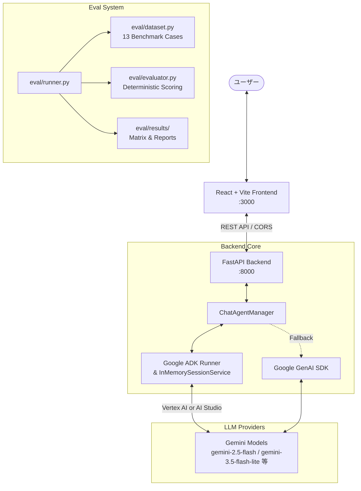

# 📘 ADK Agent Chat システム全体詳細仕様書 (SPECIFICATION)

> **⚠️ 仕様書保守ルール**:
> 本リポジトリ内のソースコード（フロントエンド・バックエンド・評価基盤）に変更・機能追加・仕様変更を加えた場合は、**必ず本仕様書 (`docs/SPECIFICATION.md`) も同期して更新すること**。
> なお、評価基盤の再設計・新機能（トラフィック蓄積/リプレイ等）については [追補仕様 (docs/SPECIFICATION_ADDENDUM_v1.md)](file:///Users/kobuchishu/programing/adk-agent-chat/docs/SPECIFICATION_ADDENDUM_v1.md) を参照。

---

## 1. システム全体概要

`ADK Agent Chat` は、Google Agent Development Kit (ADK) および Google GenAI SDK を活用した、モダンなフルスタック AI チャットボットアプリケーションです。リアルタイム対話チャット機能に加え、複数世代の LLM モデルを決定論的ルールで客観評価するベンチマーク評価基盤を備えています。



---

## 2. システム構成 & 技術スタック

| レイヤー | 使用技術 / ライブラリ | バージョン / 特徴 |
| :--- | :--- | :--- |
| **Frontend** | React, TypeScript, Vite | React 18, StrictMode |
| **Frontend Styling**| Vanilla CSS (CSS Variables) | Modern Dark Mode, Glassmorphism, Responsive |
| **Frontend Testing**| Vitest, React Testing Library | コンポーネント単体テスト |
| **Backend** | Python, FastAPI, Uvicorn | Python 3.10+, 非同期 (async/await) |
| **Agent Framework** | Google Agent Development Kit (`google-adk`) | `LlmAgent`, `Runner`, `InMemorySessionService` |
| **LLM SDK** | Google GenAI SDK (`google-genai`) | AI Studio & Vertex AI 両対応 |
| **LLM Models** | Gemini 系列 | `gemini-2.5-flash`, `gemini-2.5-pro`, `gemini-3.5-flash-lite` 等 |
| **Evaluation** | Python ルールベース評価エンジン | 決定論的アサーション (Regex, JSON Schema) |

---

## 3. バックエンド仕様 (`backend/`)

### 3.1 ディレクトリ構成
```text
backend/
├── agent.py            # ADK Agent / Runner / Session 管理
├── config.py           # 環境変数読み込み・モデル設定
├── main.py             # FastAPI ルーティング・API エンドポイント
├── requirements.txt    # バックエンド依存パッケージ
├── .env                # 環境設定ファイル (Git 管理外)
├── .env.example        # 環境変数テンプレート
├── tests/              # バックエンド単体テスト
└── eval/               # LLM ベンチマーク評価基盤
    ├── dataset.py      # 評価データセット (全13ケース)
    ├── evaluator.py    # 決定論的採点ロジック
    ├── runner.py       # ベンチマーク実行スクリプト
    └── results/        # 評価結果 (JSON / Markdown)
```

### 3.2 環境変数仕様 (`backend/config.py`)

| 環境変数名 | 必須 | デフォルト値 | 説明 |
| :--- | :---: | :--- | :--- |
| `GOOGLE_API_KEY` | △ | なし | Google AI Studio の API キー (AI Studio 経由時に必須) |
| `GOOGLE_GENAI_USE_VERTEXAI` | △ | `false` | `true` の場合、Vertex AI 経由で呼び出し (ADC 認証) |
| `GOOGLE_CLOUD_PROJECT` | △ | なし | Vertex AI 使用時の GCP プロジェクト ID |
| `GOOGLE_CLOUD_LOCATION` | - | `us-central1` | Vertex AI のリージョン (例: `global`, `us-central1`) |
| `GEMINI_MODEL` | - | `gemini-3.5-flash-lite` | チャットボットで使用するデフォルトモデル名 |
| `HOST` | - | `0.0.0.0` | API サーバー待受ホスト |
| `PORT` | - | `8000` | API サーバー待受ポート |

### 3.3 REST API エンドポイント仕様 (`backend/main.py`)

#### ① `GET /api/health`
システムヘルスチェックおよびモデル状態を取得。
- **Response (200 OK)**:
  ```json
  {
    "status": "ok",
    "model": "gemini-3.5-flash-lite",
    "adk_agent": "initialized"
  }
  ```

#### ② `GET /api/config`
フロントエンド向けのモデル・APIキー設定状態の取得。
- **Response (200 OK)**:
  ```json
  {
    "model": "gemini-3.5-flash-lite",
    "has_api_key": true
  }
  ```

#### ③ `POST /api/chat`
ユーザーメッセージを受け取り、ADK Agent / Gemini からの応答を返却。
- **Request Body**:
  ```json
  {
    "message": "こんにちは！何ができますか？",
    "session_id": "optional-uuid-string",
    "user_id": "default_user"
  }
  ```
- **Response (200 OK)**:
  ```json
  {
    "reply": "こんにちは！私は Google ADK と Gemini で動く AI アシスタントです...",
    "session_id": "550e8400-e29b-41d4-a716-446655440000",
    "model": "gemini-3.5-flash-lite"
  }
  ```
- **Error Responses**:
  - `400 Bad Request`: メッセージが空または空白のみの場合。

#### ④ `POST /api/sessions/reset`
指定されたセッション ID の会話履歴メモリをクリア。
- **Request Body**:
  ```json
  {
    "session_id": "550e8400-e29b-41d4-a716-446655440000",
    "user_id": "default_user"
  }
  ```
- **Response (200 OK)**:
  ```json
  {
    "status": "session_cleared",
    "session_id": "550e8400-e29b-41d4-a716-446655440000"
  }
  ```

### 3.4 Agent 実行 & セッション制御アーキテクチャ (`backend/agent.py`)
- **`ChatAgentManager` クラス**:
  - `LlmAgent` をインスタンス化し、システムインストラクションを付与。
  - `InMemorySessionService` によりセッション ID ごとに会話コンテキストを永続化・分離。
  - `Runner.run_async` でエージェントを実行し、イベントストリームから最終テキスト応答を抽出。
  - ADK パッケージが利用できない環境またはエラー時は、`google-genai` クライアント経由で直接 `models.generate_content` を呼び出す安全な二重フォールバック構造を実装。

---

## 4. フロントエンド仕様 (`frontend/`)

### 4.1 コンポーネント構造
```text
frontend/src/
├── App.tsx             # メインアプリケーション・状態管理・API 通信
├── main.tsx            # React エントリーポイント
├── index.css           # グローバルスタイル (Design System, Variables)
├── types.ts            # 共通型定義 (Message, Config, ChatState)
└── components/
    ├── Header.tsx      # ヘッダー (タイトル、モデルバッジ、セッションリセットボタン)
    ├── ChatMessage.tsx # メッセージ表示 (ユーザー/アシスタント吹き出し、ローディングアニメーション)
    └── ChatInput.tsx   # 入力フォーム (自動フォーカス、Enter 送信、Shift+Enter 改行)
```

### 4.2 状態管理とユーザー体験 (UX)
- **セッション永続化**: `localStorage` に `adk_chat_session_id` を保持し、ブラウザリロード後も会話継続可能。
- **リセット機能**: 「New Chat / Reset」ボタンでバックエンドのセッションを破棄し、新しい `session_id` を自動発行。
- **自動スクロール**: 新規メッセージ受信時や応答生成時に最新メッセージへスムーズスクロール。
- **自動接続確認**: アプリ起動時に `/api/config` および `/api/health` を自動ポーリングし、API 疎通状態を確認。

---

## 5. LLM ベンチマーク評価基盤仕様 (`backend/eval/`)

### 5.1 評価カテゴリとテストケース設計方針
評価は主観や LLM-as-a-judge によるブレを排除し、**100% 決定論的（Deterministic / Assertion-based）**なルールで採点します。

| カテゴリ | ケース数 | 評価内容・検証ロジック |
| :--- | :---: | :--- |
| **`structured_output`** | 3 | JSON スキーマ厳格検証。Markdown コードブロック有無の検出、期待フィールド・型の完全一致。 |
| **`negative_constraint`** | 3 | 禁止ワード（「AI」「モデル」等）の排除チェック、文字種制限（カタカナのみ等）、文字数範囲チェック。 |
| **`multi_step_reasoning`** | 3 | 複数段階の論理矛盾解決・旅程スケジュール判定・複数税率計算の正解値アサーション。 |
| **`long_context_retrieval`** | 2 | 数千字の文脈内に埋め込まれた Needle（特定トークン・障害原因）のピンポイント抽出一致。 |
| **`ambiguous_intent`** | 2 | 曖昧な質問に対して勝手な決めつけを行わず、選択肢提示・確認質問を行えているかのパターン判定。 |

### 5.2 評価データの出力スキーマ & 計測メトリクス
評価結果は、後から任意の N 候補モデルを追加してもスキーマ変更が不要な**行指向・モデル独立データ構造 (`records`)** および**実費・所要時間の完全トレース**を備えて永続化されます。

- **ファイル出力場所**: `backend/eval/results/`
- **保存成果物**:
  - `eval_raw_<timestamp>.json`: 全試行のローデータ
    - `batch_meta`: `run_id`, `started_at`, `completed_at`, `duration_sec`, `total_cost_usd`（バッチ全体の所要時間・実費）
    - `records`: 1 試行 1 レコードの行指向フラット配列 (`run_id`, `case_id`, `category`, `model`, `score`, `latency_sec`, `prompt_tokens`, `candidate_tokens`, `cost_usd`, `reasons`, `response`, `error`, `evaluated_at`)
    - `runs`: 既存互換の階層型モデル別辞書
    - `matrix`: カテゴリ別スコアマトリクス
    - `stats`: モデル別平均スコア、平均レイテンシ、合計トークン数、概算コスト (`estimated_cost_usd`)
  - `eval_report_<timestamp>.md` / `eval_report_latest.md`: 自動生成マークダウンレポート（実行サマリー、マトリクス、各ケース詳細）
  - `eval_matrix_analysis.md`: モデル × カテゴリのクロス集計マトリクス & 考察レポート

---

## 6. 仕様更新チェックリスト（開発者・AI 共通運用ルール）

ソースコードに変更を加えた際は、以下の項目を確認し、本 `SPECIFICATION.md` を更新してください：

- [ ] **エンドポイントの追加・変更**: `3.3 REST API エンドポイント仕様` を更新したか
- [ ] **環境変数の追加・変更**: `3.2 環境変数仕様` を更新したか
- [ ] **モデルやプロンプト仕様の変更**: `1. システム全体概要` または `3.4 Agent 実行仕様` を更新したか
- [ ] **UI / フロントエンド機能の追加・変更**: `4. フロントエンド仕様` を更新したか
- [ ] **評価ケース・採点ルールの追加・変更**: `5. LLM ベンチマーク評価基盤仕様` を更新したか
