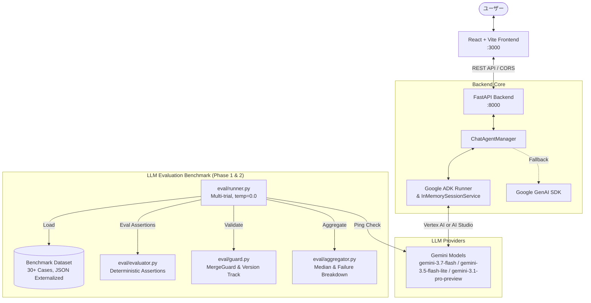

# 📘 ADK Agent Chat システム全体詳細仕様書 (SPECIFICATION)

> **⚠️ 仕様書保守・開発ルール**:
> 1. **TDD (Test-Driven Development) の徹底**: 新機能の追加、バグ修正、評価基盤の拡張・改修を行う際は、必ず **TDD (Red → Green → Refactor)** のサイクルで実装・検証すること。
> 2. **日本語コメント & Docstring の徹底**:
>    - 関数・クラス・メソッドには引数（型・意味）、戻り値（型・意味）、例外を明記した丁寧な日本語 Docstring を付与すること。
>    - 複雑なロジックには「何のために何をしているか」のステップ解説をこまめに記述すること。
>    - グローバル変数や外部モジュール参照の用途・役割を明記すること。
>    - コード変更時は必ずコメントも整合性を保って同期更新すること。
> 3. **仕様書の同期更新**: 本リポジトリ内のソースコード（フロントエンド・バックエンド・評価基盤）に変更・機能追加・仕様変更を加えた場合は、**必ず本仕様書 (`docs/SPECIFICATION.md`) も同期して更新すること**。
> 4. なお、評価基盤の再設計・新機能（トラフィック蓄積/リプレイ等）については [追補仕様 (docs/SPECIFICATION_ADDENDUM_v1.md)](file:///Users/kobuchishu/programing/adk-agent-chat/docs/SPECIFICATION_ADDENDUM_v1.md) を参照。

---

## 1. システム全体概要

`ADK Agent Chat` は、Google Agent Development Kit (ADK) および Google GenAI SDK を活用した、モダンなフルスタック AI チャットボットアプリケーションです。リアルタイム対話チャット機能に加え、複数世代の LLM モデルを決定論的ルールで客観評価するベンチマーク評価基盤を備えています。



---

## 2. システム構成 & 技術スタック

### 1.2 技術スタック

| レイヤー | 技術 / ライブラリ | バージョン / 詳細 |
| :--- | :--- | :--- |
| **Backend Framework** | FastAPI (Python) | 3.11+ / 非同期 REST API サーバー |
| **Agent Framework** | Google Agent Development Kit (ADK) | `google-adk` / `google-genai` (Fallback 対応) |
| **LLM Models** | Gemini 系列 | `gemini-3.7-flash`, `gemini-3.5-flash-lite`, `gemini-3.1-pro-preview` |
| **Frontend Testing**| Vitest, React Testing Library | コンポーネント単体テスト |
| **Backend** | Python, FastAPI, Uvicorn | Python 3.10+, 非同期 (async/await) |
| **Agent Framework** | Google Agent Development Kit (`google-adk`) | `LlmAgent`, `Runner`, `InMemorySessionService` |
| **LLM SDK** | Google GenAI SDK (`google-genai`) | AI Studio & Vertex AI 両対応 |
| **LLM Models** | Gemini 系列 | `gemini-2.5-flash`, `gemini-2.5-pro`, `gemini-3.5-flash-lite` 等 |
| **Evaluation** | Python ルールベース評価エンジン | 決定論的アサーション (Regex, JSON Schema) |

---

## 3. バックエンド仕様 (`backend/`)

### 3.1 ディレクトリ構成
```text
backend/
├── agent.py            # ADK Agent / Runner / Session 管理
├── config.py           # 環境変数読み込み・モデル設定
├── main.py             # FastAPI ルーティング・API エンドポイント
├── requirements.txt    # バックエンド依存パッケージ
├── .env                # 環境設定ファイル (Git 管理外)
├── .env.example        # 環境変数テンプレート
├── tests/              # バックエンド単体テスト
└── eval/               # LLM ベンチマーク評価基盤
    ├── dataset.py      # 評価データセット (全13ケース)
    ├── evaluator.py    # 決定論的採点ロジック
    ├── runner.py       # ベンチマーク実行スクリプト
    └── results/        # 評価結果 (JSON / Markdown)
```

### 3.2 環境変数仕様 (`backend/config.py`)

| 環境変数名 | 必須 | デフォルト値 | 説明 |
| :--- | :---: | :--- | :--- |
| `GOOGLE_API_KEY` | △ | なし | Google AI Studio の API キー (AI Studio 経由時に必須) |
| `GOOGLE_GENAI_USE_VERTEXAI` | △ | `false` | `true` の場合、Vertex AI 経由で呼び出し (ADC 認証) |
| `GOOGLE_CLOUD_PROJECT` | △ | なし | Vertex AI 使用時の GCP プロジェクト ID |
| `GOOGLE_CLOUD_LOCATION` | - | `us-central1` | Vertex AI のリージョン (例: `global`, `us-central1`) |
| `GEMINI_MODEL` | - | `gemini-3.5-flash-lite` | チャットボットで使用するデフォルトモデル名 |
| `HOST` | - | `0.0.0.0` | API サーバー待受ホスト |
| `PORT` | - | `8000` | API サーバー待受ポート |

### 3.3 REST API エンドポイント仕様 (`backend/main.py`)

#### ① `GET /api/health`
システムヘルスチェックおよびモデル状態を取得。
- **Response (200 OK)**:
  ```json
  {
    "status": "ok",
    "model": "gemini-3.5-flash-lite",
    "adk_agent": "initialized"
  }
  ```

#### ② `GET /api/config`
フロントエンド向けのモデル・APIキー設定状態の取得。
- **Response (200 OK)**:
  ```json
  {
    "model": "gemini-3.5-flash-lite",
    "has_api_key": true
  }
  ```

#### ③ `POST /api/chat`
ユーザーメッセージを受け取り、ADK Agent / Gemini からの応答を返却。
- **Request Body**:
  ```json
  {
    "message": "こんにちは！何ができますか？",
    "session_id": "optional-uuid-string",
    "user_id": "default_user"
  }
  ```
- **Response (200 OK)**:
  ```json
  {
    "reply": "こんにちは！私は Google ADK と Gemini で動く AI アシスタントです...",
    "session_id": "550e8400-e29b-41d4-a716-446655440000",
    "model": "gemini-3.5-flash-lite"
  }
  ```
- **Error Responses**:
  - `400 Bad Request`: メッセージが空または空白のみの場合。

#### ④ `POST /api/sessions/reset`
指定されたセッション ID の会話履歴メモリをクリア。
- **Request Body**:
  ```json
  {
    "session_id": "550e8400-e29b-41d4-a716-446655440000",
    "user_id": "default_user"
  }
  ```
- **Response (200 OK)**:
  ```json
  {
    "status": "session_cleared",
    "session_id": "550e8400-e29b-41d4-a716-446655440000"
  }
  ```

### 3.4 Agent 実行 & セッション制御アーキテクチャ (`backend/agent.py`)
- **`ChatAgentManager` クラス**:
  - `LlmAgent` をインスタンス化し、システムインストラクションを付与。
  - `InMemorySessionService` によりセッション ID ごとに会話コンテキストを永続化・分離。
  - `Runner.run_async` でエージェントを実行し、イベントストリームから最終テキスト応答を抽出。
  - ADK パッケージが利用できない環境またはエラー時は、`google-genai` クライアント経由で直接 `models.generate_content` を呼び出す安全な二重フォールバック構造を実装。

---

## 4. フロントエンド仕様 (`frontend/`)

### 4.1 コンポーネント構造
```text
frontend/src/
├── App.tsx             # メインアプリケーション・状態管理・API 通信
├── main.tsx            # React エントリーポイント
├── index.css           # グローバルスタイル (Design System, Variables)
├── types.ts            # 共通型定義 (Message, Config, ChatState)
└── components/
    ├── Header.tsx      # ヘッダー (タイトル、モデルバッジ、セッションリセットボタン)
    ├── ChatMessage.tsx # メッセージ表示 (ユーザー/アシスタント吹き出し、ローディングアニメーション)
    └── ChatInput.tsx   # 入力フォーム (自動フォーカス、Enter 送信、Shift+Enter 改行)
```

### 4.2 状態管理とユーザー体験 (UX)
- **セッション永続化**: `localStorage` に `adk_chat_session_id` を保持し、ブラウザリロード後も会話継続可能。
- **リセット機能**: 「New Chat / Reset」ボタンでバックエンドのセッションを破棄し、新しい `session_id` を自動発行。
- **自動スクロール**: 新規メッセージ受信時や応答生成時に最新メッセージへスムーズスクロール。
- **自動接続確認**: アプリ起動時に `/api/config` および `/api/health` を自動ポーリングし、API 疎通状態を確認。

---

## 5. LLM ベンチマーク評価基盤仕様 (`backend/eval/`)

### 5.1 測定の信頼性確保 & 評価設計原則 (Phase 1 & 2 準拠)
評価は主観や LLM-as-a-judge によるブレを排除し、**100% 決定論的（Deterministic / Assertion-based）**なルールで採点します。

1. **データセットの外部化 (`eval/datasets/benchmark_v2.json`)**: コード内リテラルから分離し、バージョン管理 (`v2.0.0`)。
2. **3カテゴリ各10ケース（計30ケース）への集中**: `structured_output`, `negative_constraint`, `multi_step_reasoning` の3カテゴリ各10件を有効化し、難易度（`basic`, `intermediate`, `advanced`）を設定。他カテゴリは `enabled: false` で保持。
3. **アサーション単位の採点 (Fine-grained Assertions)**: 各検証項目（JSON構文、キー適合、禁止文字排除等）のアサーション合否を個別記録し、ケーススコアは `passed_assertions / total_assertions` として算出。
4. **アサーション別失敗内訳レポート**: レポート上で各モデルがどの制約で何回落ちたかを可視化。
5. **生成パラメータの固定**: `temperature=0.0`, `seed=42`, 各ケース定義ごとの `max_output_tokens`。
6. **複数試行と代表値（中央値）**: 各 (case, model) に対して `EVAL_TRIALS`（既定 3 回）試行し、代表値として中央値 (Median) を採用。試行間のばらつき（min, max, stddev）および不安定ケースを自動検出。
7. **フォールバック無効モード**: 評価実行時は `allow_fallback=False` とし、ADK 失敗時は例外として扱いスコア 0 に混ぜず `status="error"` として明示分離。
8. **モデル事前疎通チェック (`eval/precheck.py`)**: 実行前に最小 ping リクエストでモデルの応答可能性を検証し、未解決モデルはスキップ。
9. **集計時マージガード (`eval/guard.py`)**: `provider_route`, `instruction_hash`, `dataset_version`, `evaluator_version` のいずれかが異なるデータの単一表への統合を禁止（`MergeGuardViolationError` 送出）。
10. **客観的レポート生成 (`eval/aggregator.py`)**: サンプル数併記 (`50.0% (1/2)`), 母数 < 5 の注意マーク `⚠️`、断定的主観文の排除。
11. **評価対象ターゲットモデル (`eval/runner.py`)**: `gemini-3.7-flash`, `gemini-3.5-flash-lite`, `gemini-3.1-pro-preview` を対象として比較評価を実施。

| カテゴリ | ケース数 | 難易度傾斜 | 評価内容・検証ロジック |
| :--- | :---: | :---: | :--- |
| **`structured_output`** | 10 | basic: 3<br/>inter: 4<br/>adv: 3 | JSON スキーマ厳格検証。Markdown コードブロック有無、キー完全一致、ネスト・配列・型適合アサーション。 |
| **`negative_constraint`** | 10 | basic: 4<br/>inter: 3<br/>adv: 3 | 禁止単語・特定文字除外（AI、カタカナ、数字、句読点、敬語、助詞「の」等の完全排除）アサーション。 |
| **`multi_step_reasoning`** | 10 | basic: 3<br/>inter: 4<br/>adv: 3 | 複数段階の論理矛盾解決・旅程スケジュール判定・複数税率計算・シフト割当・最適化計算の正解値アサーション。 |
| **`long_context_retrieval`** | 2 (保留) | inter: 1<br/>adv: 1 | （`enabled: false` として保持）数千字の文脈内に埋め込まれた Needle の抽出一致。 |
| **`ambiguous_intent`** | 2 (保留) | basic: 1<br/>inter: 1 | （`enabled: false` として保持）前提確認・選択肢提示のパターン判定。 |

### 5.2 評価データの出力スキーマ & 計測メトリクス
評価結果は、後から任意の N 候補モデルを追加してもスキーマ変更が不要な**行指向・モデル独立データ構造 (`records`)** および**実費・所要時間の完全トレース**を備えて永続化されます。

- **ファイル出力場所**: `backend/eval/results/`
- **保存成果物**:
  - `eval_raw_<timestamp>.json`: 全試行のローデータ
    - `batch_meta`: `run_id`, `started_at`, `completed_at`, `duration_sec`, `total_cost_usd`, `provider_route`, `location`, `trials_per_case`, `temperature`, `seed`, `dataset_version`, `evaluator_version`, `models`, `skipped_models`
    - `records`: 1 試行 1 レコードの行指向フラット配列 (`run_id`, `trial_index`, `case_id`, `category`, `model_id`, `score`, `latency_ms`, `prompt_tokens`, `candidate_tokens`, `cost_usd`, `instruction_hash`, `dataset_version`, `evaluator_version`, `status`, `error_type`, `raw_output`, `reasons`, `assertions`)
    - `case_summary`: (case, model) 別の中央値、最小/最大スコア、不安定判定
    - `category_matrix`: カテゴリ別スコアマトリクス（サンプル数付き）
    - `assertion_failures`: モデル・カテゴリ別のアサーション失敗内訳
    - `unstable_cases`: 試行間で結果が割れた要精査ケース一覧
  - `eval_report_<timestamp>.md` / `eval_report_latest.md`: 自動生成マークダウンレポート（実行サマリー、マトリクス、アサーション失敗内訳、各ケース詳細）
  - `eval_matrix_analysis.md`: モデル × カテゴリのクロス集計マトリクス & 考察レポート

### 5.3 実トラフィックの蓄積とリプレイ評価仕様 (Phase 3 準拠)
本番対話トラフィックを自動蓄積し、蓄積クエリに対して新候補（モデル・プロンプト・パラメータ）のバッチ再実行と決定論的差分分析を行う基盤です。

#### 1. トラフィック蓄積 (`eval/traffic/store.py`)
- **蓄積場所**: `backend/eval/traffic/data/traffic_log.jsonl`
- **蓄積スキーマ (11項目)**:
  - `query_id` (一意ID), `timestamp` (ISO日時), `session_id` (セッション識別子), `input_text` (ユーザー入力)
  - `conversation_context` (直前までの会話履歴 `[{"role": "user"|"assistant", "text": "..."}]`)
  - `output_text` (返却応答), `model_id` (使用モデル), `provider_route` (`vertex_ai` / `ai_studio`)
  - `instruction_hash` (指示ハッシュ), `generation_config` (生成パラメータ), `latency_ms` (レイテンシ)
- **個人情報保護 (PII Masking)**: `default_pii_masking_hook` により、メールアドレス (`[EMAIL]`) および電話番号 (`[PHONE]`) を保存前に自動マスキング。

#### 2. リプレイ実行ジョブ (`eval/traffic/replay.py`)
- **N 候補の一括比較**: 単一の実行ジョブで 3 候補以上の `ReplayCandidate`（モデル識別子・システムプロンプト・生成パラメータ）を指定可能。
- **データ抽出**: 期間指定、件数上限 (`limit`)、サンプリング率 (`sample_ratio`) による抽出。
- **スキーマ統一**: Phase 1.4 と完全互換な出力レコードに `source="replay"` および `candidate_id` を付与して永続化。消費トークン数・所要時間・コストを完全トラッキング。

#### 3. 決定論的差分分析 (`eval/traffic/diff_analyzer.py`)
LLM-as-a-judge を一切使わず、100% 決定論的なメトリクスで候補間の差異を算出・可視化：
- **完全一致率**: 現行本番出力文字列との完全一致割合
- **平均類似度**: レーベンシュタイン編集距離を正規化した出力類似度 (0.0〜1.0)
- **JSON 妥当性率**: 出力が JSON 構文として有効である割合
- **CodeBlock 混入率**: Markdown バッククォート (```) の混入割合
- **出力長・レイテンシ統計**: 平均文字長、平均所要時間 (ms)

---

## 6. 仕様更新チェックリスト（開発者・AI 共通運用ルール）

ソースコードに変更を加えた際は、以下の項目を確認し、本 `SPECIFICATION.md` を更新してください：

- [ ] **エンドポイントの追加・変更**: `3.3 REST API エンドポイント仕様` を更新したか
- [ ] **環境変数の追加・変更**: `3.2 環境変数仕様` を更新したか
- [ ] **モデルやプロンプト仕様の変更**: `1. システム全体概要` または `3.4 Agent 実行仕様` を更新したか
- [ ] **UI / フロントエンド機能の追加・変更**: `4. フロントエンド仕様` を更新したか
- [ ] **評価ケース・採点ルールの追加・変更**: `5. LLM ベンチマーク評価基盤仕様` を更新したか
- [ ] **日本語コメント & Docstring**: 引数・戻り値・処理意図・外部参照のコメントをコード側で同期更新したか
